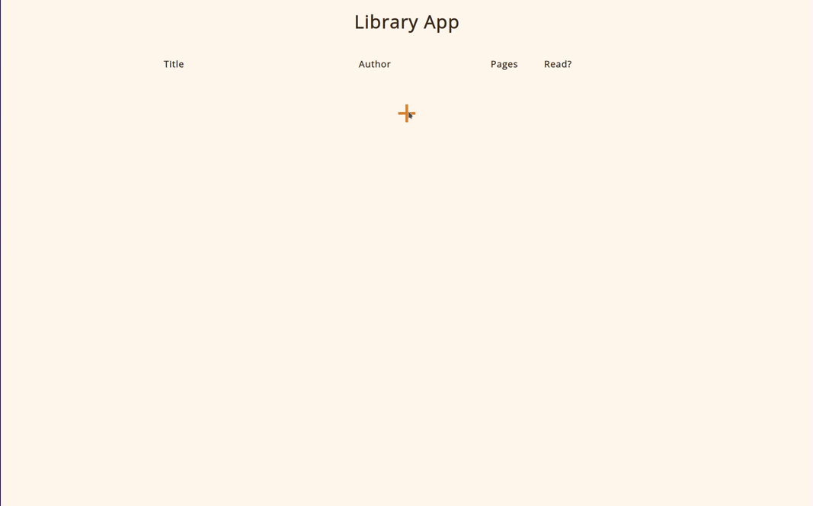

# Library

A small Library website made in HTML, CSS & JavaScript. Each new book is created as an object in JavaScript and the list is updated with its information, allowing the user to mark it as read or delete it from the list. The website does not store the list once the user leaves the site.

Made for the Odin Project - assignment link <a href="https://www.theodinproject.com/lessons/node-path-javascript-library">here</a>.

Live deployment available <a href="https://volfy.github.io/library-odin/">here</a>.

